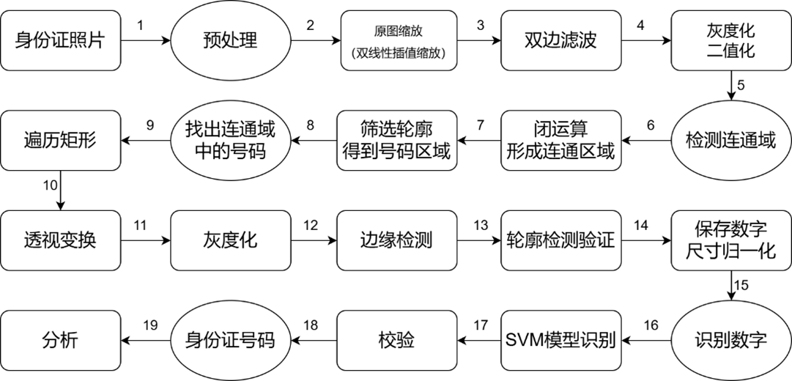
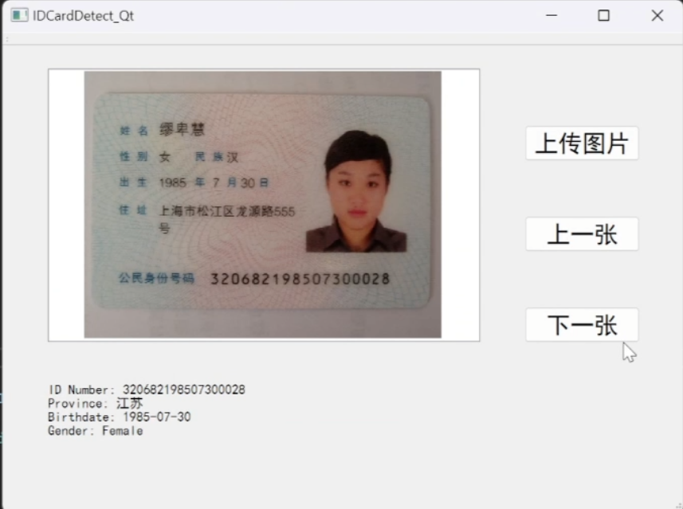
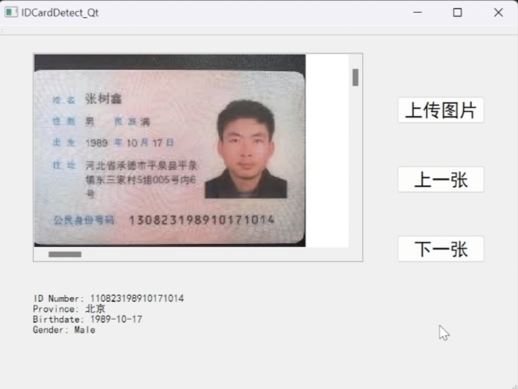

## 身份证号码识别

### KNN方法

- 思路主要来自[idNumDetect](https://github.com/ifdealer/idNumDetect) 

- 在此基础上尝试自己复现，先后实现了图像预处理（灰度化、二值化、滤波等）和形态学开闭操作，按照身份证数字区域的长宽比例提取ROI，并且进行KNN相关的训练，最终因为容错率太低不得不放弃该想法
  
### SVM方法

- 识别部分的代码参考[idcard-opencv-svm](https://github.com/1024210879/idcard-opencv-svm)

- 在此基础上加入了身份证号码的分析（省份、出生年月、性别）

- 具体实现流程如下  

- 制作Qt界面进行展示，并将代码进行整合，最终效果

